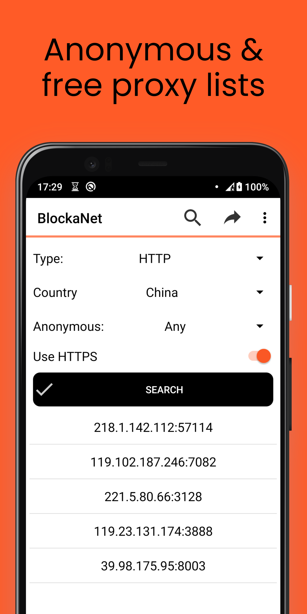
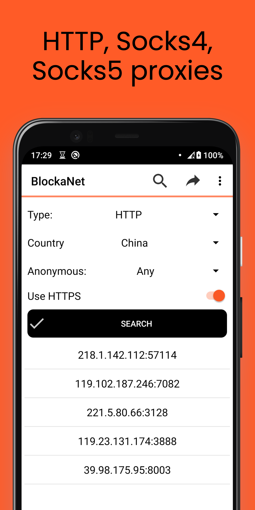
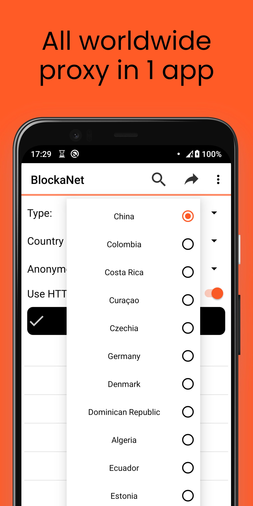

# BlockaNet: Proxy list
 

Http, https, socks4, socks5 proxy browser.

Download BlockaNet apk

## Screenshots
<table>
  <tr>
    <td></td>
    <td></td>
    <td></td>
	</tr>
</table>
  
## Telegram Bot
BlockaNet bot for telegram available [here](https://t.me/BlockaNetBot).

## Compatibility
Latest version supports Android 8.0+ (Android APi 26+) and [legacy](https://github.com/BlindZoneApps/blockanet-apk/releases/tag/2.10) version for Android 5.0+ (Android API 21+). All architectures.

## EULA & Privacy Policy
By downloading or opening the application, you accept the [user agreement and privacy policy](https://blindzone.org/eula). 
You may not: copy, modify, translate or create derivative works based on the  BlockaNet ("Software"); distribute, transfer, publish, disclose, sublicense, lease, lend, sell or rent the Software to any third party; reverse engineer, decompile, reverse decompile or disassemble the Software, or otherwise attempt to derive the source code; make the functionality of the Software available to third parties or multiple users through any means, or benchmark or conduct any performance or comparison tests on the Software. BlindZone LLC reserves all rights in and to the Software not expressly granted to you under EULA.
